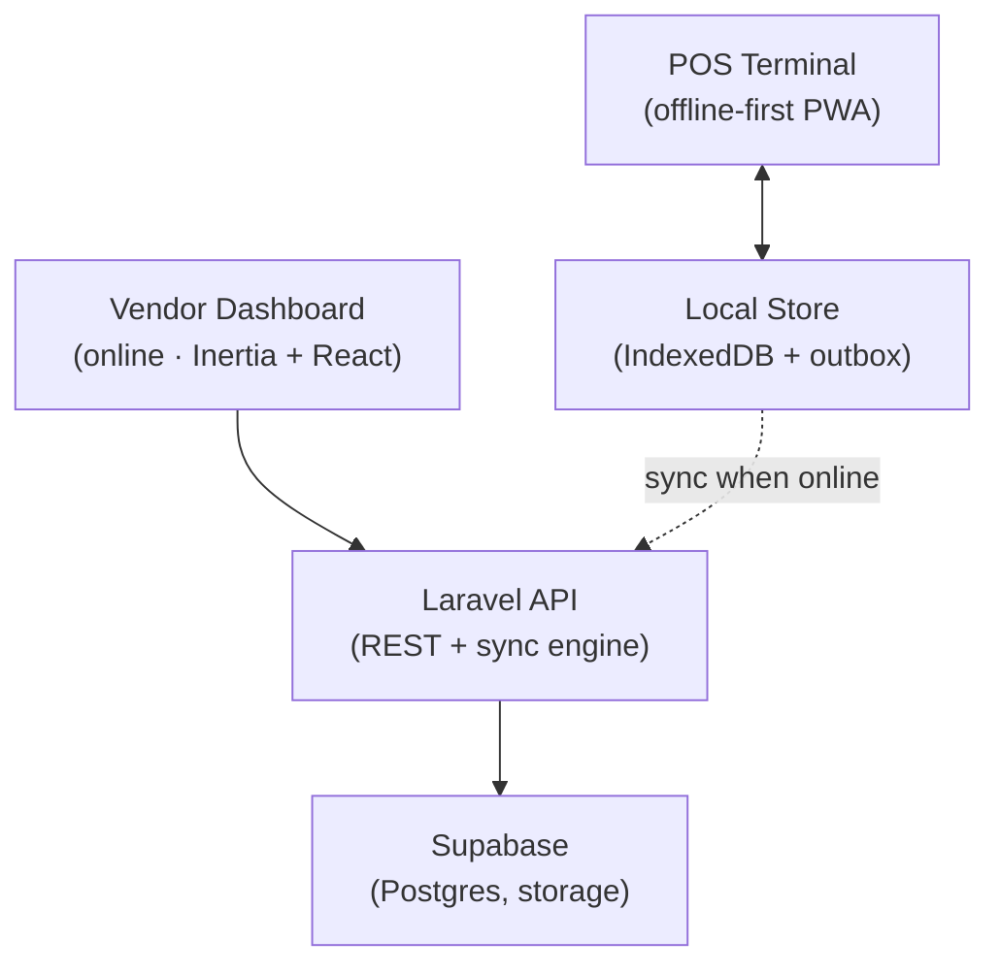
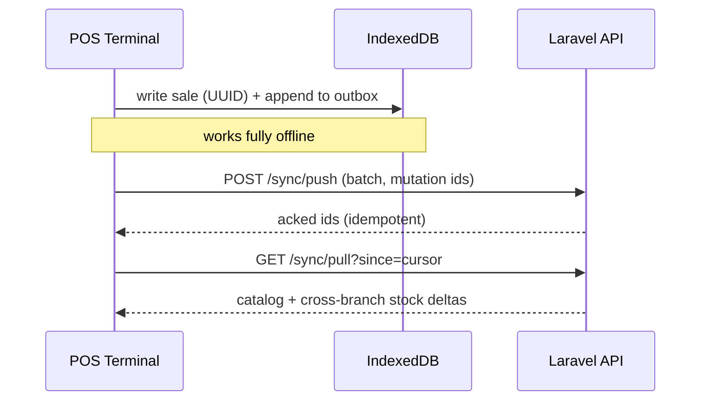

# Wivae — System Architecture

> Status: **Draft for review** · Owner: Engineering · Reviewed by: Cowork
> This document is the north star. Code decisions defer to it; when they diverge, we update this doc in the same PR.

---

## 1. What Wivae is

Wivae is a multi-tenant, **offline-first** point-of-sale platform for small and medium businesses. A single Wivae backend serves many independent merchants ("tenants"), each on their own subdomain, each able to run one or more branches. The two things that shape every decision below:

1. **The till must sell without internet.** Connectivity in the field is unreliable; losing a sale because the network dropped is unacceptable. Sales happen locally and reconcile when the connection returns.
2. **One backend, many tenants, white-labellable.** A merchant's brand — logo, colours, subdomain — sits on top of the same infrastructure. Wivae's own branding is just the default tenant theme.

### Goals

- A merchant can sign up, start a 7-day trial, and take their first sale the same day.
- The till keeps working through a full internet outage and reconciles cleanly afterward, with no lost or double-counted sales or stock.
- Adding a tenant costs nothing operationally — no per-tenant deploys.
- Retail and restaurant modes share one core; mode is a tenant setting, not a fork.

### Non-goals (for the MVP)

- Wivae does **not** process the customer's in-store payment. The till records *how* the customer paid (cash, EcoCash, card) as a label for the merchant's own reporting. Wivae never touches that money.
- No multi-currency at launch. USD only. (The schema keeps a `currency` column so this is a later feature, not a migration.)
- No native mobile app store presence at launch. The till is a PWA; a Capacitor shell is a hardware-provisioning detail, not a separate product.

---

## 2. High-level architecture

Two clients, one backend. This split is the single most important structural decision, and it exists because an online, server-driven page cannot run offline — so the till cannot be a server-driven page.



- **Vendor Dashboard** — Laravel + Inertia + React, server-driven, online-only. Inventory, branches, staff, analytics, billing, white-label config, ZIMRA config. This is back-office; it's fine for it to require a connection.
- **POS Terminal** — a Progressive Web App. React + Tailwind, service worker, IndexedDB (via Dexie). Holds its own local database, runs the cart and checkout without the network, and syncs through the same Laravel API. **Not Inertia** — Inertia is server-driven and would defeat the offline requirement.
- **Laravel API + sync engine** — one backend serving both clients. Owns identity, tenancy, authorization (Policies), the sync endpoints, and all writes to Postgres.
- **Supabase** — managed Postgres (the system of record) plus Storage (product images, receipts, white-label assets). Used as a database, not as an application framework: no Supabase Auth, no client-side Supabase calls, no reliance on RLS for primary authorization (see §7).

---

## 3. Tech stack and the reasoning behind it

| Layer | Choice | Why this and not the obvious alternative |
|---|---|---|
| Backend | Laravel 12 | Batteries-included, strong queue/job story (Horizon), mature multi-tenancy packages. |
| Dashboard UI | Inertia 2 + React 19 + TypeScript | Server-driven pages without building a separate SPA + API for the back office. |
| POS UI | Standalone React PWA (Vite) | Must run offline; cannot be Inertia. Shares the design system with the dashboard, not the transport. |
| Styling | Tailwind CSS 4 | One design language across both clients; brand tokens drive white-label. |
| Database | Supabase Postgres | Managed Postgres. We use Postgres features (JSONB, generated columns), not Supabase-the-framework. |
| Auth | Laravel Fortify + Socialite | Session-cookie auth for a server-driven dashboard. No second identity system to reconcile. |
| Queue | Redis + Horizon | Sync reconciliation, ZIMRA submission, and heavy imports run off the request cycle. |
| Local store (POS) | IndexedDB via Dexie | The only durable, structured, large-capacity offline store in the browser. |

### Decisions worth remembering

- **Auth lives in Laravel, not Supabase.** The dashboard is server-driven with session cookies; a JWT identity system buys nothing and costs a reconciliation layer. Supabase is Postgres only.
- **Authorization lives in Laravel Policies, not Postgres RLS.** Laravel connects with a privileged role and bypasses RLS by definition. RLS stays enabled as deny-all *defense in depth*, but it is not the primary gate. (§7)
- **Money is integer minor units (`amount_cents`) + a `currency` column, never floats.** This is financial correctness, independent of the USD-only decision. Floats silently lose cents; a POS cannot.
- **VAT is inclusive: the shelf price is what the customer pays.** Tax is backed
  out of the price (`vat = price * rate / (100 + rate)`), not added on top. This
  is Zimbabwean retail convention and it is a *decision*, not an implementation
  detail — the reference designs contradicted each other on it (one till mockup
  showed "VAT 15.5% (included)", one receipt showed VAT added to a subtotal), and
  the two produce different totals from the same price list. Receipts must still
  show the VAT breakdown for ZIMRA, so the number is displayed either way; only
  the arithmetic differs. **Not yet implemented — `tax.ts` still returns 0% for
  every class, so sales recorded today carry zero tax and sales are immutable.**
- **The brand name is configuration, never a literal.** Everything reads `config('brand')`. This is also the white-label mechanism: a tenant's branding row overrides the Wivae defaults. (§8)

---

## 4. Multi-tenancy

**Model: single database, shared schema, `tenant_id` on every tenant-owned row.** Standard for an SME SaaS MVP — cheapest to run, simplest to reason about, scales far enough. Schema-per-tenant or DB-per-tenant is a later option if a large customer demands hard isolation; nothing here blocks it.

**Tenant resolution: by subdomain.** `acme.wivae.com` → tenant `acme`. A `ResolveTenant` middleware reads the subdomain, loads the tenant, and binds it into a request-scoped `TenantContext`. A `BelongsToTenant` Eloquent trait adds a global scope so queries are automatically filtered, and auto-fills `tenant_id` on create. Forgetting a `where('tenant_id', …)` should be structurally impossible, not a discipline.

**Isolation is layered:** application scope (global scope, primary), plus Postgres RLS as a tripwire, plus the fact that the session cookie is domain-scoped to the tenant subdomain.

---

## 5. Data model

The full schema lives in `database/migrations/`. This section captures the shape and the two ideas that matter.

### 5.1 Stock is a ledger, not a number

The hardest part of offline sync is inventory. Two branches sell the last unit while both offline — whose "quantity = 4" is correct? Neither, if you store quantities.

So **stock is an append-only ledger of movements**, not a mutable count:

- `stock_movements(id UUID, tenant_id, branch_id, product_id, delta, reason, ref, occurred_at)` — every sale, purchase, transfer, and adjustment is one immutable row (`-1`, `+50`, `-3`).
- Current stock is `SUM(delta)` per product/branch, cached in `stock_levels` and recomputable from the ledger at any time.

Two offline sales append two `-1` rows that sum correctly on sync. There is no conflict to resolve. This is what turns "distributed conflict resolution" into "insert two rows."

### 5.2 Completed sales are immutable

A finished sale never changes. That removes the other big class of conflicts: sales made offline on different devices simply arrive and insert; they never contend. Corrections are *new* records (refunds, voids), never edits.

### 5.3 Table groups

- **Tenancy & billing:** `tenants` (subdomain, `branding` jsonb, plan, `trial_ends_at`, `zimra_enabled`, status), `branches`, `staff` (role, PIN for fast till login), `subscriptions`, `hardware_orders`.
- **Catalog:** `categories`, `products` (sku, barcode, `price_cents`, tax_class, type retail/restaurant), `suppliers`, `purchase_orders`, `purchase_order_lines`.
- **Inventory:** `stock_movements` (the ledger), `stock_levels` (cache), `branch_transfers`.
- **Sales:** `sales` (UUID PK, offline timestamps, sync + fiscal status), `sale_lines`, `payments` (tender label + `amount_cents`), `receipts`.
- **Restaurant:** `tables`, `kitchen_orders`.
- **Fiscal:** `fiscal_submissions`.

Every POS-writable row carries: UUID primary key (client-generated so offline records have stable IDs), `tenant_id`, `updated_at`, soft-delete, and a sync cursor.

---

## 6. The sync engine

The heart of the product. Design principles:

- **Client-generated UUIDs.** The till mints IDs offline; the server never reassigns them. This is what makes offline records first-class.
- **Outbox pattern.** Every local mutation is written to the local store *and* appended to an outbox with a client mutation id.
- **Idempotent push.** On reconnect, the outbox flushes to `POST /sync/push` in batches. Replays are safe: the server dedupes by mutation id, so a flaky connection that sends the same batch twice changes nothing.
- **Cursor-based pull.** `GET /sync/pull?since=<cursor>` returns everything changed since the device last synced (price changes, new products, stock from other branches).
- **Bootstrap snapshot.** A new device calls `GET /sync/bootstrap` for a full tenant/branch snapshot, then switches to incremental pull.
- **No conflict resolution needed for the hot paths.** Sales are immutable (insert-only); stock is a ledger (deltas sum). The only mutable catalog data (prices, product names) is server-authoritative and flows one way, dashboard → till, via pull. Last-write-wins on those is acceptable and simple.



---

## 7. Security & tenant isolation

- **Primary authorization: Laravel Policies** against Eloquent, scoped by `TenantContext`. Every dashboard and API action passes through a policy.
- **RLS as a tripwire.** Deny-all RLS policies on tenant tables catch a class of bugs (a query that somehow escapes the global scope), but are not relied on as the gate, because the app's DB role is privileged.
- **Till auth is device-bound + PIN.** A provisioned device authenticates once; cashiers log into shifts with a PIN. PINs are for speed and attribution, not for securing the backend — the device credential does that.
- **The session cookie is shared across subdomains — so isolation can't lean on it.** With `SESSION_DOMAIN=.wivae.test` (leading dot), the auth cookie is sent to *every* tenant subdomain. Subdomain scoping is therefore **not** the isolation boundary. The real gates are (a) every query is tenant-scoped by the global scope, and (b) authentication verifies the user belongs to the tenant of the request host (see below). In production `SESSION_DOMAIN` drops the leading dot, but a shared parent-domain cookie is still assumed, so the host check stands regardless.
- **Secrets never in chat or client.** Supabase keys, Paynow keys, and ZIMRA credentials live in server-side `.env` only. The anon key is never shipped to any browser — the browser never talks to Supabase directly.

### Authentication is exempt from the tenant scope

Session re-hydration looks the user up on every request. When that lookup ran through the `BelongsToTenant` global scope it returned `null` whenever tenant context wasn't set at that instant, which desynced the `auth` and `guest` middleware into an infinite `/login ⇄ /dashboard` redirect loop. The lesson: **a user's identity comes from the signed session cookie; their tenant is a property of the record — re-filtering the lookup by an ambient scope is both redundant and fragile.**

Decision: **auth user lookups bypass the global scope, and tenant membership is verified explicitly by host.** A custom `TenantUserProvider` (registered as the `tenant` auth driver; `config/auth.php` points `providers.users.driver` at it) loads the user by their globally-unique UUID with `withoutGlobalScopes()`, then confirms `tenant_id` matches the tenant resolved from the request host. It resolves the tenant from the host directly, so it does not depend on middleware ordering. Login (`retrieveByCredentials`) stays tenant-scoped, but explicitly by the host's tenant rather than via the ambient scope. This is both the fix for the loop and a security gain: because the session cookie is shared across subdomains (above), the host check is what stops a session minted on tenant A from being replayed on tenant B's host.

### The `{tenant}` domain wildcard can leak into a route's other parameters

Both tenant-scoped route groups (`ResolveTenant` for the dashboard, `ResolveDevice` for the bearer-token POS API) are registered on `Route::domain('{tenant}.' . $rootDomain)`. That `{tenant}` wildcard is a real entry in the matched route's parameter bag — and on a route with exactly one other parameter and a plain scalar type-hint (e.g. `update(Request $request, string $staff)`), Laravel's controller-argument resolution can bind the **domain's** value (the tenant subdomain, e.g. `"demo"`) into `$staff` instead of the UUID from `{staff}`. The controller then calls `User::findOrFail("demo")`, which throws, which renders as a 404 — indistinguishable from a routing/cache problem, which is what made this one hard to isolate. It affects both implicit model-binding and explicit scalar parameters equally; converting `User $staff` to `string $staff` does **not** fix it.

**Fix:** both `ResolveTenant` and `ResolveDevice` call `$request->route()?->forgetParameter('tenant')` after they've extracted what they need — `ResolveTenant` parses the tenant from `$request->getHost()` directly, never from the route parameter, so nothing downstream depends on it staying in the bag. Any *new* tenant-scoped route group added later (a third `Route::domain('{tenant}.'...)` block) needs the same call, or its parameterized routes will intermittently 404 the same way.

### Dev environment: `public/pos/` shadows routes under `artisan serve`

Building the till to `public/pos/` puts a **real directory** under `public/`, and PHP's built-in server handles that badly. For any path beneath it (e.g. `/pos/session`) it treats `public/pos/index.html` as the script and sets `SCRIPT_NAME=/pos/index.html`, `PHP_SELF=/pos/index.html/session`. Symfony's `Request::prepareBaseUrl()` derives the base URL from those, and `preparePathInfo()` strips it from `REQUEST_URI`, producing `/session` instead of `/pos/session` — so **no route matches and every POS API call 404s while `route:list` shows the routes registered correctly.**

That divergence is the diagnostic signature: routing is fine, the request is corrupted *below* the routing layer. Note also that `/pos` itself is served statically by the directory match, so "the till loads" does **not** prove routing works — probe a path that cannot exist on disk (`/pos/zzz`) instead.

Fix: a root-level **`server.php`** (ServeCommand prefers it over the framework's bundled `resources/server.php`) resets `SCRIPT_NAME`, `SCRIPT_FILENAME`, and `PHP_SELF` to the real front controller before requiring `public/index.php`. Its static-passthrough branch is verified to still serve `/pos/assets/*`, `sw.js`, and the manifest while letting `/pos/session`, `/sync/*`, and PWA deep links reach Laravel.

**Dev-only.** Under Apache/nginx the web server sets these correctly and handles static files itself (`!-f`/`!-d` rewrite conditions, or `try_files $uri $uri/ /index.php`), so `server.php` is never loaded in production.

### The offline till: token auth, standalone shell, data-safe cache

The POS terminal is a **standalone PWA** — its own Vite build to `public/pos/`, served at `{tenant}.wivae.test/pos` — deliberately **not** folded into `laravel-vite-plugin`. Keeping it separate lets it own a real `index.html` and a service worker with a clean `/pos/` scope; the multi-input alternative fights both. The shell is served by `PosShellController` (invokable, not a route closure, so the route stays `route:cache`-able) and runs **no `ResolveTenant`, no session, no CSRF** — it is static and tenant-agnostic.

Tenancy and identity come entirely from the **device bearer token**. `ResolveDevice` hashes the token, loads the device, and binds both tenant and branch into context; the token — not the subdomain or a session — is authoritative, so sync behaves identically online, offline, and on reconnect. The `/sync/*` and `/pos/session` routes are CSRF-exempt for the same reason (stateless, token-authenticated).

**Service-worker cache policy: precache the shell, never the data.** Workbox (via `vite-plugin-pwa`, `generateSW`) precaches only the app shell — JS, CSS, HTML, icons — so the till cold-loads with no network. All business data lives in IndexedDB, not the HTTP cache. API paths are excluded from navigation cache fallback (`navigateFallbackDenylist` covers `/sync/` and `/pos/session`), so the network is always authoritative for catalog and sales and the service worker can never serve a stale price or a duplicated sale. Offline reads come from the local store by design; offline writes queue in the outbox (§6) — never from a cached response.

---

## 8. White-label and brand-as-config

The Wivae name and theme live in `config/brand.php` and are read everywhere — page titles, receipt headers, email from-names, the PWA manifest, the default theme. Nothing hardcodes "Wivae."

This is the same mechanism as white-label: a tenant's `branding` JSONB overrides the Wivae defaults at request time. Building brand-as-config in Phase 1 makes white-label (Phase 8) nearly free. The production root domain is a single env var (`APP_TENANT_DOMAIN`), so tenancy, cookie scope, and subdomain routing all derive from one place.

---

## 9. External integrations

### 9.1 Paynow — subscription billing only

Paynow handles **Wivae's own subscription revenue**: the $30/mo BYOD plan and the $20/mo ZIMRA add-on. It lives entirely in the dashboard billing module and **never touches the till**. In-store customer payments are recorded as labels only; Wivae does not process them.

**Resolved:** the open item — card-on-file recurring vs. per-period prompt — was verified, not assumed. A live forum thread on Paynow's own support site (Nov 2025) shows their documentation and their support channel directly disagreeing about whether tokenized recurring billing is actually available. Given that contradiction, `PaynowService` always creates a fresh payment prompt per billing period — never an automatic recurring charge. This is the fallback the architecture already named as safe, now confirmed as the actual implementation rather than a placeholder.

**Built on the official `paynow/php-sdk` Composer package** (confirmed current from `developers.paynow.co.zw`'s PHP quickstart), not hand-rolled HTTP calls — `createPayment()` → `send()` → `redirectUrl()`/`pollUrl()`, matching Paynow's own documented usage exactly.

**Webhook trust model:** Paynow's result-URL callback includes a `hash` field for authenticity, but the exact hash algorithm isn't published in their quickstart docs. Rather than guess at security-critical verification logic, the webhook handler treats the incoming POST as a mere "something changed" trigger — it never parses or trusts the body. `PaynowService::checkStatus()` then calls the SDK's documented `pollTransaction()` to fetch status directly from Paynow's own server, which is inherently trustworthy (HTTPS straight to Paynow) without needing to verify a hash on data the request itself supplied.

Requires `composer require paynow/php-sdk` and `PAYNOW_INTEGRATION_ID`/`PAYNOW_INTEGRATION_KEY` in `.env` (from the Paynow merchant dashboard) before it can run live.

### 9.2 ZIMRA fiscalisation — optional, offline-aware

A paid, feature-flagged add-on. Fiscalisation **cannot happen offline**: a sale completes and prints a provisional receipt, and the fiscal submission queues and fires on sync, within ZIMRA's allowed grace window (72 hours, per public guidance). `fiscal_devices` tracks device registration state; QR + signature are attached to the receipt on success (not yet implemented — see below).

**Spec pinned:** Fiscal Device Gateway API Specification **v7.2**, fetched directly from `zimra.co.zw`'s official downloads on 2026-07-19 (not reconstructed from memory — this was the explicit open item blocking Phase 7). Confirmed from the primary source:

- **Auth is mutual TLS**, not an API key — every endpoint except `verifyTaxpayerInformation`, `registerDevice`, and `getServerCertificate` requires a client certificate FDMS itself issues.
- **Registration**: ZIMRA portal registration → `deviceID` (int) + 8-char `activationKey` → generate a CSR (ECDSA P-256 or RSA 2048, Common Name format `ZIMRA-<serial>-<10-digit-zero-padded-deviceId>`) → `registerDevice` exchanges it for an X.509 certificate that signs everything after.
- **Every receipt is signed**: SHA-256 hash of specific fields + a device signature using the device's private key, per the algorithm in spec §13 — the one section not fully captured in what was fetched, and not something to implement from a partial read.
- **Fiscal day lifecycle** (`openDay` → `submitReceipt`* → `closeDay`) has strict sequential counters — `receiptGlobalNo`/`receiptCounter`/`fiscalDayNo` — that must never skip or reorder.
- **Tax formula validated**: FDMS's own inclusive-VAT math (`taxAmount = lineTotal × rate / (1 + rate)`) is identical to what `pos/src/lib/tax.ts` already implements independently — good confirmation the till's VAT model is compatible with what fiscalisation will eventually need.
- Environments: `https://fdmsapitest.zimra.co.zw` (test, has Swagger UI) and `https://fdmsapi.zimra.co.zw` (production).

**What's built (`FiscalisationService`):** `verifyTaxpayerInformation` — the one public, read-only endpoint. An owner enters Device ID/Activation Key/Serial and it makes a real call to confirm those resolve to their actual ZIMRA taxpayer record, before anything sensitive happens. The exact REST path for this endpoint is the one piece **not** confirmed from a primary source (Swagger's spec loads via JS this environment can't execute) — it's called and, if wrong, fails loudly with ZIMRA's real HTTP response surfaced to the owner, not silently.

**What's deliberately not built:** device registration (CSR generation), receipt signing, and the fiscal day state machine. Each needs either the un-fetched §13 signature algorithm confirmed byte-for-byte, or live testing against ZIMRA's test environment with real credentials — building these from an incomplete spec read is exactly the failure mode this section exists to prevent.

### 9.3 HR & Payroll — salary-based, PAYE confirmed, NSSA deliberately not

**Scope:** salary-based payroll only. There is no shift/clock time-tracking system, so hourly payroll isn't attempted — Tasks (§Phase "Tasks") tracks checklist items, not worked hours, and building real time-tracking is a distinct, later feature.

**PAYE + AIDS levy are real**, computed with ZIMRA's confirmed monthly USD brackets ($0–$100 exempt, 20% to $300, 25% to $3,000, 40% above) plus the standard 3% AIDS levy on tax due — sourced directly from ZIMRA's own PAYE page and corroborated by an independent source, not from training-data memory. The bracket math was executed and asserted against boundary cases (below threshold, exactly at threshold, one case per band), not just hand-checked.

**NSSA is deliberately not hardcoded.** Secondary sources actively disagreed on the current employee contribution rate (3.5% vs. 4.5% across different sites) and on the insurable earnings ceiling, and NSSA is administered by a separate authority from ZIMRA that wasn't independently verified. Rather than pick between two contradicting numbers, the rate and ceiling are tenant-configured (`tenants.nssa_rate_bps`/`nssa_ceiling_cents`), defaulting to 0/off — payroll runs with $0 NSSA deducted until an owner sets their own confirmed rate.

---

## 10. API surface (representative)

```
# Dashboard (session-cookie auth)
POST   /register                      create tenant + owner + start 7-day trial
GET    /dashboard                     back-office home
resource /products /categories /branches /staff /suppliers /purchase-orders
GET    /analytics/*                   read models

# POS terminal (device auth)
POST   /pos/login                     device + PIN
GET    /sync/bootstrap                full snapshot for a new device
POST   /sync/push                     idempotent batch of local mutations
GET    /sync/pull?since=<cursor>      incremental changes

# Billing (Paynow — subscriptions only)
POST   /billing/subscribe
POST   /webhooks/paynow               payment status callbacks

# Fiscal (internal + callback)
POST   /fiscal/submit                 queued
POST   /webhooks/zimra                fiscal result
```

---

## 11. Delivery plan

Each phase retires the largest remaining **unknown**, not the largest feature. That's why offline sync comes before six of the eight product surfaces.

| Phase | Branch | Retires |
|---|---|---|
| 1 | `feat/foundation` | Tenancy isolation, Supabase pooler wiring, onboarding + trial, roles, brand-as-config |
| 2 | `feat/catalog` | "Is stock-as-ledger workable" — products, categories, branches, movement ledger, CSV import |
| 3 | `feat/pos-offline` | **The offline/sync risk** — PWA, IndexedDB, outbox, push/pull, bootstrap, DeviceBridge interface |
| 4 | `feat/payments-receipts` | Tender labels, receipts, and the Bluetooth thermal-printing spike (decides Capacitor shell) |
| 5 | `feat/restaurant` | Tables, kitchen queue, gratuity (feature-flagged per tenant type) |
| 6 | `feat/analytics` | Dashboard read models: sales overview, top products, dead-stock, branch performance |
| 7 | `feat/zimra` | FDMS integration, fiscal queue, offline-aware submission (verify spec first) |
| 8 | `feat/billing-whitelabel` | Paynow subscriptions, plans/hardware orders, tenant branding + subdomains |

### The DeviceBridge (Phase 3 onward)

Every hardware capability sits behind one interface — `printReceipt()`, `scanBarcode()`, `openDrawer()`. The React POS app calls the interface and never knows its host. The PWA implementation uses Web Bluetooth / Web APIs; the Capacitor implementation calls native plugins. The Phase 4 printing spike decides which ships on provisioned hardware, without the app changing.

---

## 12. Ways of working

- No commits to `main`. Every phase is a `feat/*` branch → PR → Cowork review → merge.
- Migrations are committed as files and **applied by the team**, never executed against the database by automation in this workflow.
- This document is versioned with the code and updated in the same PR whenever a decision changes.

---

## 13. Open questions

1. **Root domain** — `wivae.com`, `wivae.co.zw`, or other? Seeds tenancy middleware, cookie domain, subdomain routing. (Dev uses `wivae.test`.)
2. ~~**Paynow recurring**~~ — resolved: per-period prompt, not card-on-file (see §9.1). Confirmed via Paynow's own support forum, not assumed.
3. **ZIMRA FDMS spec** — pinned at v7.2 (see §9.2). Remaining: confirm the exact REST paths via Swagger, and get the full §13 signature algorithm before implementing device registration/receipt signing.
4. **Hosting topology** — Horizon on the same box as web for MVP, or separate from day one?
