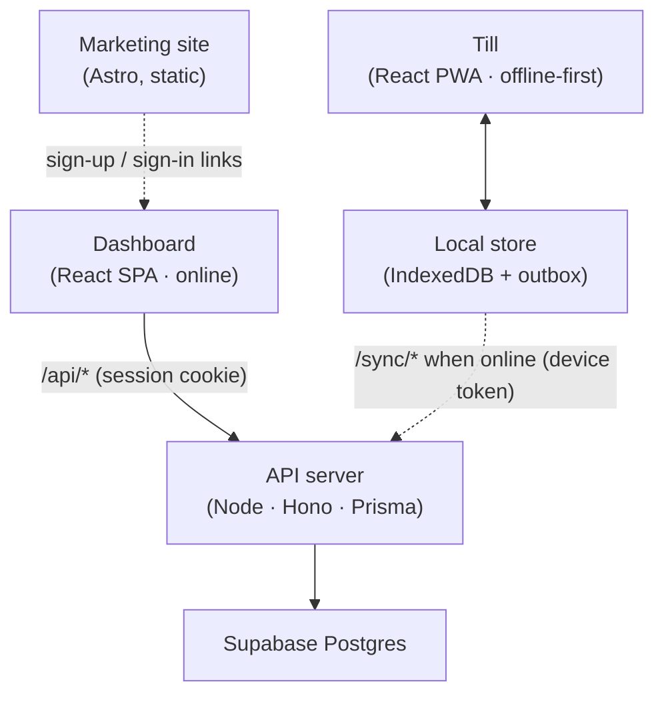
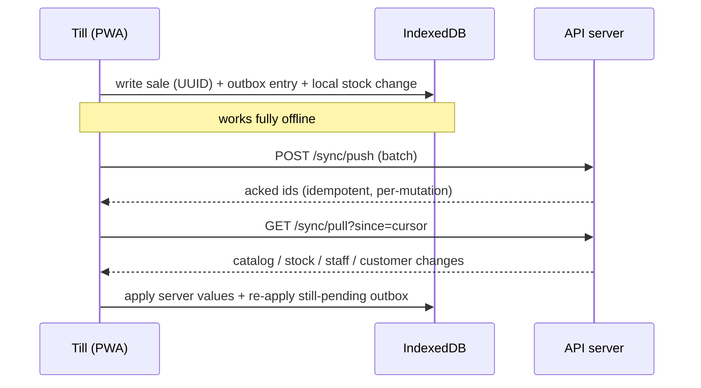

# Wivae — System Architecture

> This document is the north star. Code decisions defer to it; when they diverge, we update this doc in the same PR.
> Section numbers are cited from code comments (e.g. "ARCHITECTURE.md §6") — keep them stable.

---

## 1. What Wivae is

Wivae is a multi-tenant, **offline-first** point-of-sale platform for small and medium businesses. A single Wivae backend serves many independent merchants ("tenants"), each on their own subdomain, each able to run one or more branches. The two things that shape every decision below:

1. **The till must sell without internet.** Connectivity in the field is unreliable; losing a sale because the network dropped is unacceptable. Sales happen locally and reconcile when the connection returns.
2. **One backend, many tenants, white-labellable.** A merchant's brand — logo, colours, subdomain — sits on top of the same infrastructure.

### Goals

- A merchant can sign up, start a 7-day trial, and take their first sale the same day (sign-up → signed-in dashboard → "Get selling" checklist → paired till).
- The till keeps working through a full internet outage and reconciles cleanly afterward, with no lost or double-counted sales or stock.
- Adding a tenant costs nothing operationally — no per-tenant deploys.
- Retail, restaurant, hardware and workshop businesses share one core. The **till mode is a per-branch setting**, not a fork: one business can run a shop and a restaurant.

### Non-goals (for the MVP)

- Wivae does **not** process the customer's in-store payment. The till records *how* the customer paid (cash, EcoCash, credit…) as a label for the merchant's own reporting. Wivae never touches that money. ("Credit" moves no money at all — it adds to a customer's balance.)
- No multi-currency at launch. USD only. (The schema keeps a `currency` column so this is a later feature, not a migration.)
- No native app-store presence at launch. The till and the dashboard are installable PWAs; a Capacitor shell is a hardware-provisioning detail, not a separate product.

---

## 2. High-level architecture

Four front-ends, one backend. The split that matters most is **dashboard vs till**: an online, server-driven page cannot run offline, so the till is its own app with its own local database.


```mermaid
flowchart TD
    Mkt["Marketing site<br/>(Astro, static)"]
    Dash["Dashboard<br/>(React SPA · online)"]
    POS["Till<br/>(React PWA · offline-first)"]
    IDB["Local store<br/>(IndexedDB + outbox)"]
    API["API server<br/>(Node · Hono · Prisma)"]
    DB["Supabase Postgres"]

    Mkt -. "sign-up / sign-in links" .-> Dash
    Dash -- "/api/* (session cookie)" --> API
    POS <--> IDB
    IDB -. "/sync/* when online (device token)" .-> API
    API --> DB
```

- **Dashboard** (`resources/js/`) — React SPA, online-only back office: products & stock, branches, staff, customers, orders & transactions, reports, billing, branding, ZIMRA settings. Talks to `/api/*` with a session cookie.
- **Till** (`pos/`) — a PWA with its own local database (Dexie/IndexedDB). Runs the cart and checkout with no network and syncs through `/sync/*` using a **device bearer token**, never a session.
- **API server** (`server/`) — one Node process (Hono) serving both clients: identity, tenancy, authorization, the sync engine, and all writes to Postgres. In production it also serves the built dashboard and till as static files.
- **Marketing site** (`marketing/`) — Astro, fully static, deployed separately. Pricing, sign-up, and "sign in to your workspace".
- **Supabase** — managed Postgres, the system of record. Used as a database only: no Supabase Auth, no client-side Supabase calls, no reliance on RLS for primary authorization (see §7).

---

## 3. Tech stack and the reasoning behind it

| Layer | Choice | Why |
|---|---|---|
| API | Node 22 + Hono | Small, fast, TypeScript end to end — one language across all four apps. |
| Data access | Prisma 7 (`@prisma/adapter-pg`) | Typed queries; a query extension enforces tenant scoping (§4). |
| Validation | Zod | Every request body is parsed; failures become a uniform `{ message, errors }` 422. |
| Dashboard | React 19 + React Router 7 + Vite 6 | Plain SPA over a JSON API; no server-rendered framework needed for a back office. |
| Till | Standalone React PWA (Vite + `vite-plugin-pwa`) | Must run offline; owns its own service worker and `/pos/` scope. |
| Marketing | Astro 5 (static) | The one place SEO and first-paint speed matter; independent of API uptime. |
| Styling | Tailwind CSS 4 | One design language; theme tokens drive light/dark and white-label. |
| Database | Supabase Postgres | Managed Postgres. We use Postgres, not Supabase-the-framework. |
| Auth | Encrypted cookie sessions (`hono-sessions`) + bcrypt; device tokens for tills | No second identity system to reconcile. |
| Local store (till) | IndexedDB via Dexie | The only durable, structured, large-capacity offline store in the browser. |

### Decisions worth remembering

- **Auth lives in the API, not Supabase.** Dashboard users have a session cookie; tills have a device token. Supabase is Postgres only.
- **Authorization is in the API's route handlers, not Postgres RLS.** The app's database role bypasses RLS, so RLS can only be a deny-all tripwire (§7).
- **Money is integer minor units (`*_cents`) + a `currency` column, never floats.** Floats silently lose cents; a POS cannot.
- **VAT is inclusive: the shelf price is what the customer pays.** Tax is backed out of the price (`vat = price × rate / (1 + rate)`), not added on top — Zimbabwean retail convention, and the same formula ZIMRA's FDMS uses (§9.2). The rate is per tenant (`tenants.tax_rate_bps`, Settings → General) and applies to `standard`-rated products only. Receipts show the VAT breakdown.
- **Branding is data, not code.** A tenant's `branding` JSONB (logo, colours) themes their dashboard and till; Wivae's look is just the default (§8).

---

## 4. Multi-tenancy

**Model: single database, shared schema, `tenant_id` on every tenant-owned row.** Standard for an SME SaaS MVP — cheapest to run, simplest to reason about, scales far enough. Schema- or database-per-tenant is a later option if a large customer demands hard isolation; nothing here blocks it.

**Tenant resolution: by subdomain.** `acme.wivae.com` → tenant `acme`. `resolveTenant` (`server/src/middleware/resolveTenant.ts`) reads the host, loads the tenant, and runs the rest of the request inside `runWithTenant()`. The root domain is one env var, `TENANT_DOMAIN` — `localhost` in dev (every `*.localhost` name reaches the machine with no hosts-file edits and is a secure context), the real domain in production.

**Scoping is structural, not a discipline.** `server/src/lib/tenantScope.ts` holds the current tenant in `AsyncLocalStorage` and wraps Prisma with a query extension: every query on a tenant-scoped model gets `tenant_id` injected into its `where` (or `data`), and a scoped query with **no tenant in context throws** instead of running unscoped. The one escape hatch, `withoutTenantScope()`, is for the few places that genuinely precede a tenant: sign-up, and looking up a till's device by its token.

**Tills resolve their tenant from the device token**, not the host (`resolveDevice`) — so sync behaves identically online, offline, and on reconnect.

**Isolation is layered:** the query extension (primary), an explicit host check on every authenticated request (§7), and Postgres RLS as a tripwire.

---

## 5. Data model

The full schema is `prisma/schema.prisma`. It's applied with `prisma db push` — the database has no migration history, so `prisma/migrations/` is not a reliable record (see SETUP.md). This section captures the shape and the two ideas that matter.

### 5.1 Stock is a ledger, not a number

The hardest part of offline sync is inventory. Two tills sell the last unit while both offline — whose "quantity = 4" is correct? Neither, if you store quantities.

So **stock is an append-only ledger of movements**, not a mutable count:

- `stock_movements(id UUID, tenant_id, branch_id, product_id, delta, reason, ref, occurred_at)` — every sale (`-qty`), delivery (`purchase`), opening stock (`initial`), void reversal (`void`) and stock count correction (`adjustment`) is one immutable row.
- Current stock is `SUM(delta)` per product **per branch**, cached in `stock_levels` and recomputable from the ledger at any time.

Two offline sales append two negative rows that sum correctly on sync — there is no conflict to resolve. A till's own branch is always the device's branch, never a value from the request payload. Tills refuse to sell more than they have on hand, but two tills offline at once can still both sell the last unit; the ledger then shows negative stock, which a **stock count** (Products → Count) corrects with an `adjustment` row.

### 5.2 Completed sales are immutable

A finished sale never changes. That removes the other big class of conflicts: sales made offline on different devices simply arrive and insert; they never contend. Corrections are *new* records, never edits: a void (requested, then approved by an owner/manager) flips the sale's status and appends reversing stock movements, and takes any credit back off the customer's balance.

### 5.3 Table groups

- **Tenancy & billing:** `tenants` (subdomain, `branding` jsonb, plan, `trial_ends_at`, tax rate, NSSA settings, status), `branches` (per-branch till `mode`), `users` (staff: role, dashboard password and/or till PIN), `devices` (hashed till tokens), `subscriptions`.
- **Catalog:** `categories`, `products` (sku, barcode, `price_cents`, `tax_class`, `track_stock`, type).
- **Inventory:** `stock_movements` (the ledger), `stock_levels` (cache).
- **Sales:** `sales` (client UUID, offline `occurred_at`, status), `sale_lines`, `payments` (tender label + `amount_cents`), `void_requests`.
- **Credit:** `customers` (`balance_cents` cache), `customer_payments` (repayment ledger).
- **Restaurant:** `tables`, `kitchen_orders`.
- **Operations:** `tasks`, `payroll_runs`, `payslips`, `fiscal_devices`, `enquiries`.

Every till-writable row has a client-generated UUID primary key, so offline records have stable ids.

---

## 6. The sync engine

The heart of the product (`pos/src/sync/`, `server/src/domain/pos/syncService.ts`). Design principles:

- **Client-generated UUIDs.** The till mints ids offline; the server never reassigns them.
- **Outbox pattern.** Every local mutation (`sale.create`, `stock.receive`, `debt.repay`) is written to the local store **and** queued in an outbox in one transaction, with its local effect applied immediately (stock decremented, balance updated) so the till is correct while offline.
- **Idempotent push.** `POST /sync/push` applies each mutation in its own transaction; replays are safe because ids are primary keys. A bad mutation is rejected on its own without blocking the rest of the batch; the till retries it with exponential backoff and flags it as "stuck" after 5 genuine rejections. A server outage never counts against a queued sale.
- **Cursor-based pull.** `GET /sync/pull?since=<cursor>` returns what changed (products, prices, stock, staff, tables, customers — with tombstones for removals). The cursor is taken *before* the queries run, minus a 60-second overlap, so a change committed during a slow pull is never skipped; pull is idempotent (absolute values), so the overlap is harmless. Only pull moves the cursor.
- **Pending mutations survive a pull.** The server's figures exclude anything still in this till's outbox, so pull re-applies the outbox's pending effects on top — otherwise a sale waiting to upload would reappear as unsold stock.
- **Bootstrap snapshot.** A new device calls `GET /sync/bootstrap` for a full branch snapshot, then switches to incremental pull.
- **No conflict resolution needed for the hot paths.** Sales are insert-only; stock is a ledger; balances are ledgers too. The mutable catalog (names, prices) is server-authoritative and flows one way, dashboard → till. Last-write-wins on those is acceptable and simple.


```mermaid
sequenceDiagram
    participant Till as Till (PWA)
    participant IDB as IndexedDB
    participant API as API server
    Till->>IDB: write sale (UUID) + outbox entry + local stock change
    Note over Till,IDB: works fully offline
    Till->>API: POST /sync/push (batch)
    API-->>Till: acked ids (idempotent, per-mutation)
    Till->>API: GET /sync/pull?since=cursor
    API-->>Till: catalog / stock / staff / customer changes
    Till->>IDB: apply server values + re-apply still-pending outbox
```

---

## 7. Security & tenant isolation

- **Primary authorization in the route handlers**, on top of the tenant-scoped query layer (§4). Owner/manager-only actions (stock changes, voids, staff, billing…) check the role explicitly.
- **Every authenticated request re-checks tenant membership by host.** `requireAuth` loads the session's user and rejects them unless `user.tenant_id` matches the tenant resolved from the request host — so a session minted on tenant A can't be replayed on tenant B, whatever the cookie's scope. (Dev leaves `SESSION_DOMAIN` unset: browsers refuse a `.localhost` cookie, so each workspace has its own. Production shares it across subdomains via `SESSION_DOMAIN=.yourdomain.com`.)
- **Sign-up hands off with a one-time token**, not a shared cookie: a signed, tenant-bound, single-use, 2-minute token (`server/src/lib/handoff.ts`) carried in the URL fragment and traded for a session on the new workspace.
- **Tills are device-bound + PIN.** A till pairs once with a device token (stored only as a SHA-256 hash); cashiers start shifts with a 4-digit PIN checked offline against a bcrypt hash. PINs are for speed and attribution, not for securing the backend — the device token does that. Stock receipts and credit repayments at the till are owner/manager-only.
- **RLS as a tripwire.** A deny-all RLS migration exists (`prisma/migrations/…_enable_rls`) so Supabase's auto-generated public API returns nothing; the app's role bypasses it. It is not yet applied to the dev database.
- **CORS is an allowlist** (the tenant domain and its subdomains), and responses carry a restrictive CSP.
- **Secrets never reach a browser.** Supabase, Paynow and ZIMRA credentials live in `server/.env` only.

### The till: standalone shell, data-safe cache

The till is served at `/pos/` with its own manifest and service worker. **The service worker caches the app shell, never data**: Workbox precaches JS/CSS/HTML/icons so the till cold-loads with no network, while `/sync/*`, `/pos/session` and `/api/*` are excluded from any cache — so it can never serve a stale price or replay a sale. Offline reads come from IndexedDB; offline writes queue in the outbox (§6).

The dashboard is installable too (its own manifest, scope `/`). Browsers only offer install on a secure context — HTTPS, `localhost` or `*.localhost` — and, once installed, show their own "Open in app".

---

## 8. White-label and branding

A tenant's `branding` JSONB (logo, primary colour — Settings → Branding) themes their dashboard and till at runtime; Wivae's look is the default when it's empty. Each tenant is already on its own subdomain, so white-label is configuration, not a deploy. The root domain is a single env var (`TENANT_DOMAIN`), so tenancy, cookie scope and subdomain routing all derive from one place.

---

## 9. External integrations

### 9.1 Paynow — subscription billing only

Paynow takes **Wivae's own subscription revenue**. It lives in the dashboard's Payments page and **never touches the till**; in-store customer payments are labels only.

Plans (priced server-side in `server/src/routes/billing.ts` — never from the client): **BYOD** $19.99/month; **Standard** $199.99 and **Premium** $249, bought once, each including hardware and the first month — then a monthly maintenance fee that differs by plan — **$7** on Standard, **$12** on Premium (`MAINTENANCE_FEES_CENTS` in `server/src/domain/billing/maintenance.ts`). It was set at about 2–2.5× the *estimated* cost to serve a business at around 30 businesses — roughly $3 for Standard and $5 for Premium (hosting split across them, Paynow's fee, reminders, support time; Premium carries more: ZIMRA fiscalisation upkeep, payroll, priority support) — and the multiple grows with the business count, so revisit it against the real bills, and the marketing site deliberately says only "plus a monthly fee" — owners see their own figure in the dashboard, the reminders and where they pay. BYOD ($19.99/month, no setup) stays cheaper than Standard for the first ~14 months; from about month 15 Standard is cheaper overall. The dashboard's Payments page renders the plan list the server returns, so the two can't drift. Premium includes ZIMRA fiscalisation; there is no separately sold ZIMRA add-on.

`server/src/lib/paynow.ts` is a small client verified against Paynow's official SDK source and docs: it starts a one-time payment and verifies the SHA-512 hash on the result webhook before trusting it. Paynow has no "charge again next month" primitive, so BYOD's monthly re-billing needs a scheduled job that issues a new payment link each period — **not built yet** (there is no job scheduler; see §13). The same holds for the maintenance fee: every payment buys one 30-day period (a later payment continues from the end of the one already paid for, a late one starts from today — no back-billing), the owner pays it by hand — one month at a time, or ahead with free months (6 for the price of 5, 12 for the price of 10; the months *covered* ride in the payment reference, `..._m6`, and the price is worked out server-side from `billedMonths`) — and is reminded as the period runs out (`server/src/domain/billing/reminders.ts`: by email 5 days before, 1 day before, when it ends, 2 days before the tills pause and when they do; by text, to an owner who gave a mobile number, all but the first; each channel claimed in `billing_reminders` before it is sent, so none goes twice; off unless `BILLING_REMINDERS=on`). Texts go through `server/src/lib/sms.ts` (Twilio so far; numbers are kept as E.164 by `lib/phone.ts` on `users.phone`). When a period runs out the dashboard locks at once and the tills get a grace period before sync pauses — 14 days for Standard and Premium (they paid up front and owe only the monthly fee), 3 days for BYOD and trials (`deviceGraceDays`) (`ensureSubscribed` guards the dashboard, `ensureDeviceSubscribed` the till routes; a paused till keeps its sales on the device and syncs them once the business pays). A Standard/Premium row with no end date predates maintenance and is treated as paid for good.

Needs `PAYNOW_INTEGRATION_ID` / `PAYNOW_INTEGRATION_KEY` in `server/.env`.

### 9.2 ZIMRA fiscalisation — optional, offline-aware

A plan-gated feature (Premium, or during the trial). Fiscalisation **cannot happen offline**: a sale completes and prints a provisional receipt, and the fiscal submission must queue and fire on sync, within ZIMRA's grace window (72 hours, per public guidance).

**Spec pinned:** Fiscal Device Gateway API Specification **v7.2**, from `zimra.co.zw`'s official downloads (2026-07-19). Confirmed from the primary source:

- **Auth is mutual TLS**, not an API key — every endpoint except `verifyTaxpayerInformation`, `registerDevice` and `getServerCertificate` needs a client certificate FDMS issues.
- **Registration**: ZIMRA portal → `deviceID` + 8-char `activationKey` → generate a CSR (ECDSA P-256 or RSA 2048, CN `ZIMRA-<serial>-<10-digit-zero-padded-deviceId>`) → `registerDevice` returns the signing certificate.
- **Every receipt is signed** (SHA-256 of specific fields + device signature, spec §13 — the one section not fully captured, and not something to implement from a partial read).
- **Fiscal day lifecycle** (`openDay` → `submitReceipt`* → `closeDay`) with strict sequential counters that must never skip or reorder.
- **Tax formula** matches the till's inclusive VAT exactly (§3).
- Environments: `https://fdmsapitest.zimra.co.zw` (test) and `https://fdmsapi.zimra.co.zw` (production).

**What's built** (`server/src/routes/fiscalisation.ts`): the settings screen — enabling fiscalisation, saving a device's ZIMRA details, and a "verify taxpayer" step that is currently a **placeholder** (no live FDMS call yet). **Not built:** the real `verifyTaxpayerInformation` call, device registration (CSR), receipt signing, and the fiscal-day state machine — each needs the §13 algorithm confirmed byte-for-byte or live testing against ZIMRA's test environment.

### 9.3 HR & Payroll — salary-based, PAYE computed, NSSA configured

**Scope:** salary-based payroll only — there's no clock-in/out, so hourly payroll isn't attempted.

**PAYE + AIDS levy** are computed from ZIMRA's published monthly USD brackets plus the 3% AIDS levy on tax due, sourced from ZIMRA's own PAYE page.

**NSSA is not hardcoded.** Sources disagreed on the current employee rate and insurable-earnings ceiling, so both are tenant settings (`tenants.nssa_rate_bps` / `nssa_ceiling_cents`), defaulting to off until an owner sets their confirmed figures.

---

## 10. API surface (representative)

```
# Central (no tenant) — /api
POST   /api/register                   create tenant + branch + owner (password & till PIN), 7-day trial
GET    /api/tenant-lookup?subdomain=   does a workspace exist / is the name reserved

# Workspace dashboard (session cookie) — /api on <workspace>.<domain>
POST   /api/welcome                    trade the sign-up hand-off token for a session
POST   /api/login · /api/logout · GET /api/me
GET    /api/onboarding                 "Get selling" checklist state (+ starter products, one-click till)
       /api/products /categories /branches /staff /customers /devices /tasks ...
GET    /api/orders?date=&branchId=     one business-local day's sales + summary
GET    /api/transactions?date=&branchId=
GET    /api/billing/payments           plans + current subscription
POST   /api/billing/payments/subscribe start a Paynow payment
POST   /api/billing/webhook            Paynow result callback (no session; hash-verified)

# Till (device bearer token)
GET    /pos/session                    device, branch, tenant settings
GET    /sync/bootstrap                 full snapshot for a new device
POST   /sync/push                      idempotent batch of local mutations
GET    /sync/pull?since=<cursor>       incremental changes
```

---

## 11. Delivery plan

Each phase retired the largest remaining **unknown**, not the largest feature — that's why offline sync came before most product surfaces. The phases were first delivered on a Laravel backend; the product has since been rebuilt on the Node/Hono stack above, keeping the same data model and sync design.

| Phase | Retired |
|---|---|
| 1 | Tenancy isolation, Supabase pooler wiring, onboarding + trial, roles, branding |
| 2 | "Is stock-as-ledger workable" — products, categories, branches, movement ledger, CSV import |
| 3 | **The offline/sync risk** — PWA, IndexedDB, outbox, push/pull, bootstrap, DeviceBridge interface |
| 4 | Tender labels, receipts, and the Bluetooth thermal-printing spike (decides Capacitor shell) |
| 5 | Tables, kitchen queue, gratuity (restaurant branches) |
| 6 | Dashboard read models: sales overview, top products, dead-stock, branch performance |
| 7 | ZIMRA FDMS — spec pinned, settings built; submission still to do (§9.2) |
| 8 | Paynow subscriptions, plans, tenant branding + subdomains |

### The DeviceBridge (Phase 3 onward)

Every hardware capability sits behind one interface — `printReceipt()`, `scanBarcode()`, `openDrawer()` (`pos/src/hardware/`). The till calls the interface and never knows its host. The PWA implementation uses Web Bluetooth / Web APIs; a Capacitor implementation would call native plugins. The printing spike (`docs/spikes/phase-4-thermal-printing.md`) decides which ships on provisioned hardware, without the app changing.

---

## 12. Ways of working

- No commits straight to `main`: feature branch → pull request → review → merge.
- Schema changes go in `prisma/schema.prisma` and are **applied by a person** (`npx prisma db push`), never by automation.
- This document is versioned with the code and updated in the same PR whenever a decision changes.

---

## 13. Open questions

1. **Root domain** — `wivae.com`, `wivae.co.zw`, or other? It sets `TENANT_DOMAIN`, `SESSION_DOMAIN` and the dashboard's `VITE_TENANT_DOMAIN`. (Dev uses `*.localhost`.)
2. **Migration baseline** — the database was built with `db push` and has no migration history; `prisma/migrations/` needs a baseline before `prisma migrate deploy` can be used in production.
3. **Background jobs** — nothing schedules work yet. Needed for BYOD monthly re-billing (§9.1) and the offline fiscal submission queue (§9.2). (`bullmq`/`ioredis` are installed but unused.)
4. **ZIMRA FDMS** — confirm the exact REST paths via Swagger and the full §13 signature algorithm before implementing registration and receipt signing (§9.2).
5. ~~**Paynow recurring**~~ — resolved: a fresh payment per period, not card-on-file; Paynow's own docs and support contradicted each other on tokenized recurring billing.
